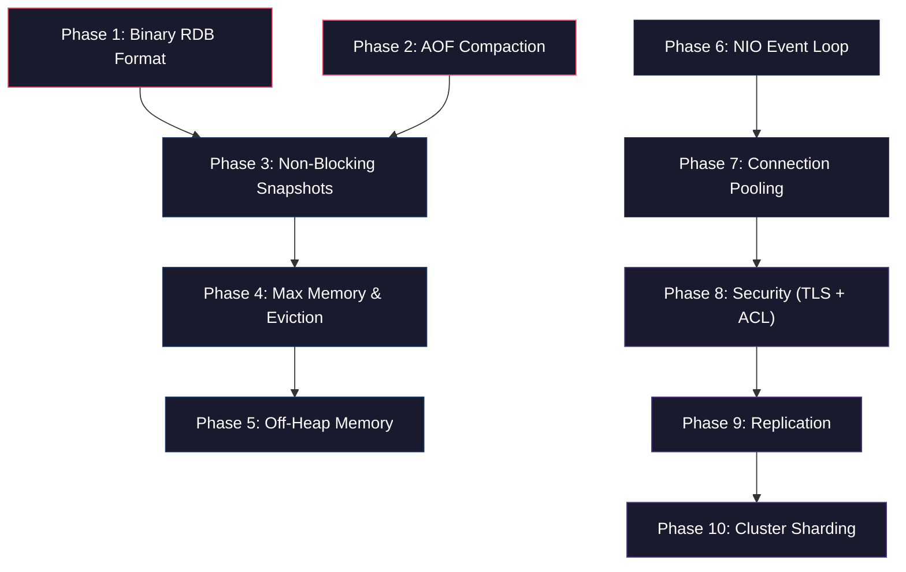

# 🔴 Mini Redis — Production-Grade Implementation Plan

A complete, phased plan to upgrade Mini Redis from an educational prototype into a production-grade in-memory database. Each phase builds on the previous one, so there is **zero confusion** about what to implement and in what order.

---

## Current Architecture Summary

Before we start, here is what exists today:

| Component | Current Implementation | File |
| :--- | :--- | :--- |
| **Networking** | Blocking `ServerSocket` + Thread-per-client (`ExecutorService`) | [RedisServer.java](file:///d:/project/java%20project/mini-redis/src/main/java/com/miniredis/server/RedisServer.java), [ClientHandler.java](file:///d:/project/java%20project/mini-redis/src/main/java/com/miniredis/server/ClientHandler.java) |
| **Protocol** | `BufferedReader`-based RESP2 parser (blocking I/O) | [RespParser.java](file:///d:/project/java%20project/mini-redis/src/main/java/com/miniredis/protocol/RespParser.java) |
| **Data Store** | `ConcurrentHashMap<String, RedisObject>` on JVM heap | [DataStore.java](file:///d:/project/java%20project/mini-redis/src/main/java/com/miniredis/store/DataStore.java) |
| **Value Wrapper** | `RedisObject` holding `Object value` (String, LinkedList, LinkedHashSet, LinkedHashMap) | [RedisObject.java](file:///d:/project/java%20project/mini-redis/src/main/java/com/miniredis/store/RedisObject.java) |
| **Expiry** | Lazy (on-access) + Active (background sampling) via `ConcurrentHashMap<String, Long>` | [ExpiryManager.java](file:///d:/project/java%20project/mini-redis/src/main/java/com/miniredis/store/ExpiryManager.java) |
| **Persistence** | JSON-based RDB snapshots + Tab-separated AOF text log | [RdbSnapshotter.java](file:///d:/project/java%20project/mini-redis/src/main/java/com/miniredis/persistence/RdbSnapshotter.java), [AofEngine.java](file:///d:/project/java%20project/mini-redis/src/main/java/com/miniredis/persistence/AofEngine.java) |
| **Routing** | `HashMap<String, CommandHandler>` dispatch | [CommandRouter.java](file:///d:/project/java%20project/mini-redis/src/main/java/com/miniredis/command/CommandRouter.java) |
| **Pub/Sub** | `ConcurrentHashMap<String, Set<ClientHandler>>` | [PubSubManager.java](file:///d:/project/java%20project/mini-redis/src/main/java/com/miniredis/pubsub/PubSubManager.java) |

---

## Implementation Order & Dependencies



> [!IMPORTANT]
> **Phases 1–5** (Storage & Memory) and **Phase 6–7** (Networking) are **independent tracks** and can be worked on in parallel. **Phases 8–10** (Security, Replication, Clustering) depend on both tracks being complete.

---

## Phase 1: Binary RDB Format
**Goal**: Replace human-readable JSON snapshots with a compact, high-performance binary format.

**Why First**: This is the simplest change with no architectural disruption. It establishes the binary serialization foundation that Phase 3 (Non-Blocking Snapshots) will rely on.

### Binary File Layout (MRDB Format)

```
┌────────────────────────────────────────────────────────────────────┐
│  HEADER                                                            │
│  ┌──────────┬──────────┬──────────────┐                           │
│  │ "MRDB"   │ Version  │  Key Count   │                           │
│  │ 4 bytes  │ 2 bytes  │  4 bytes     │                           │
│  └──────────┴──────────┴──────────────┘                           │
├────────────────────────────────────────────────────────────────────┤
│  DATA ENTRIES (repeated for each key)                              │
│  ┌──────────┬──────────┬──────────┬─────────────┬────────────────┐│
│  │ HasTTL   │ TTL ms   │ DataType │ Key (UTF-8) │ Value payload  ││
│  │ 1 byte   │ 0 or 8B  │ 1 byte   │ len + bytes │ type-specific  ││
│  └──────────┴──────────┴──────────┴─────────────┴────────────────┘│
├────────────────────────────────────────────────────────────────────┤
│  FOOTER                                                            │
│  ┌──────────────────┐                                              │
│  │  CRC32 Checksum  │                                              │
│  │  4 bytes          │                                              │
│  └──────────────────┘                                              │
└────────────────────────────────────────────────────────────────────┘
```

### Files to Change

#### [MODIFY] [ServerConfig.java](file:///d:/project/java%20project/mini-redis/src/main/java/com/miniredis/config/ServerConfig.java)
- Line 16: Change `private String rdbFilename = "dump.json"` → `"dump.rdb"`

#### [MODIFY] [RdbSnapshotter.java](file:///d:/project/java%20project/mini-redis/src/main/java/com/miniredis/persistence/RdbSnapshotter.java)
- **Delete**: All JSON helper methods (`jsonString()`, `jsonStringArray()`, `jsonStringMap()`, `parseSnapshot()`, `parseKeyBlock()`, `extractJsonStringValue()`, `findClosingQuote()`, `findMatchingBrace()`, etc.)
- **Rewrite `save()`**: Use `DataOutputStream` to write:
  1. Magic bytes `MRDB` (4 bytes)
  2. Version `1` (short, 2 bytes)
  3. Key count (int, 4 bytes)
  4. For each key: expiry flag → optional TTL → type byte → key UTF-8 → value payload
  5. CRC32 checksum (int, 4 bytes)
- **Rewrite `load()`**: Use `DataInputStream` to:
  1. Validate magic header
  2. Read version
  3. Loop through keys, deserializing each based on type byte
  4. Verify CRC32 checksum at end

### Verification
```bash
mvn clean test
```
Then manually: start server → SET/LPUSH/SADD/HSET various keys → run SAVE → stop server → restart → verify all keys restored from binary `dump.rdb`.

---

## Phase 2: AOF Compaction (AOF Rewrite)
**Goal**: Reduce AOF file size by rewriting it to contain only the minimal set of commands needed to reconstruct the current state.

**Why**: Without compaction, running `INCR counter` 1 million times creates 1 million lines in the AOF. After rewrite, it becomes a single `SET counter 1000000`.

### How It Works

```
┌──────────────────────────────────────┐
│       Original AOF (10,000 lines)     │
│  SET x 1                              │
│  INCR x                               │
│  INCR x                               │
│  ... (9,997 more INCRs)               │
│  SET y hello                           │
└──────────────────┬───────────────────┘
                   │ AOF Rewrite
                   ▼
┌──────────────────────────────────────┐
│       Rewritten AOF (2 lines)         │
│  SET x 10000                           │
│  SET y hello                           │
└──────────────────────────────────────┘
```

### Files to Change

#### [MODIFY] [AofEngine.java](file:///d:/project/java%20project/mini-redis/src/main/java/com/miniredis/persistence/AofEngine.java)
- **Add method** `rewrite(DataStore dataStore)`:
  1. Create a temporary file `appendonly.aof.rewrite`
  2. Iterate over all keys currently in the `DataStore`
  3. For each key, generate the minimal command to reconstruct it:
     - STRING → `SET key value`
     - LIST → `RPUSH key elem1 elem2 ...`
     - SET → `SADD key member1 member2 ...`
     - HASH → `HSET key field1 val1 field2 val2 ...`
  4. If the key has a TTL, also write `EXPIRE key <remaining_seconds>`
  5. Atomically rename `appendonly.aof.rewrite` → `appendonly.aof`
  6. Reopen the writer on the new file
- **Add method** `getFileSize()`: Returns the current AOF file size in bytes (for triggering auto-rewrite)

#### [MODIFY] [ServerConfig.java](file:///d:/project/java%20project/mini-redis/src/main/java/com/miniredis/config/ServerConfig.java)
- Add fields:
  - `private long aofRewriteMinSize = 1_048_576;` (trigger rewrite if AOF > 1MB)
  - `private int aofRewriteGrowthPercent = 100;` (trigger rewrite if AOF doubled since last rewrite)

#### [MODIFY] [PersistenceManager.java](file:///d:/project/java%20project/mini-redis/src/main/java/com/miniredis/persistence/PersistenceManager.java)
- Add a periodic check (every 30s) that compares AOF file size against thresholds and triggers `aofEngine.rewrite(dataStore)` when needed
- Track `lastRewriteSize` to calculate growth percentage

#### [NEW] `src/main/java/com/miniredis/command/server/BgRewriteAofCommand.java`
- Implements the `BGREWRITEAOF` command so users can manually trigger AOF rewrite
- Register in [CommandRouter.java](file:///d:/project/java%20project/mini-redis/src/main/java/com/miniredis/command/CommandRouter.java)

### Verification
Start server → run 10,000 `INCR counter` commands → check AOF file size → run `BGREWRITEAOF` → verify AOF shrinks to ~2 lines → restart server → verify `counter` value is correct.

---

## Phase 3: Non-Blocking Snapshots
**Goal**: Save RDB snapshots without freezing client request processing.

**Why**: Currently, `RdbSnapshotter.save()` is `synchronized` and iterates the entire store while holding the lock. With millions of keys, this blocks all client commands for seconds.

### Design: Copy-on-Write Snapshot

Since Java doesn't have `fork()` like C/Linux, we will implement a snapshot-isolation approach:

```
┌────────────────────────────────────────────────────┐
│  Main Thread (serving clients)                      │
│                                                     │
│  1. Take a READ LOCK                                │
│  2. Shallow-copy the ConcurrentHashMap (O(n) refs) │
│  3. Copy the expiryMap references                   │
│  4. Release READ LOCK                               │
│  5. Hand the snapshot copy to a background thread   │
│                                                     │
│  ──── continues serving clients immediately ────    │
└────────────────────────────────────────────────────┘

┌────────────────────────────────────────────────────┐
│  Background Thread                                  │
│                                                     │
│  1. Receives the snapshot HashMap + expiryMap copy  │
│  2. Serializes to binary RDB format (Phase 1)      │
│  3. Writes to temp file → atomic rename             │
│  4. Logs completion                                 │
└────────────────────────────────────────────────────┘
```

### Files to Change

#### [MODIFY] [RdbSnapshotter.java](file:///d:/project/java%20project/mini-redis/src/main/java/com/miniredis/persistence/RdbSnapshotter.java)
- **Add method** `backgroundSave()`:
  1. Take a snapshot of `dataStore.getRawStore()` using `new HashMap<>(store)` (shallow copy of references)
  2. Take a snapshot of `expiryManager.getRawExpiryMap()` using `new HashMap<>(expiryMap)`
  3. Submit a `Runnable` to a dedicated single-thread `ExecutorService` that serializes the snapshot maps using the binary format from Phase 1
  4. Track `isSaving` state to prevent concurrent background saves
- **Keep `save()`** as the synchronous version (used during shutdown for a guaranteed final save)

#### [MODIFY] [PersistenceManager.java](file:///d:/project/java%20project/mini-redis/src/main/java/com/miniredis/persistence/PersistenceManager.java)
- Change `startPeriodicSnapshots()` to call `backgroundSave()` instead of `save()`
- Add `isBgSaveInProgress()` method

#### [NEW] `src/main/java/com/miniredis/command/server/BgSaveCommand.java`
- Implements `BGSAVE` command for manual background saves
- Register in CommandRouter

### Verification
Start server → load 100,000 keys → trigger `BGSAVE` → verify server continues responding to `PING`/`GET` commands instantly while the save runs in the background.

---

## Phase 4: Max Memory & Eviction Policies
**Goal**: Prevent `OutOfMemoryError` crashes by enforcing a memory limit and automatically deleting old keys.

### Eviction Algorithms to Implement

| Policy | Algorithm | Description |
| :--- | :--- | :--- |
| `noeviction` | None | Return error on writes when memory full (default) |
| `allkeys-lru` | LRU | Evict the **least recently used** key from all keys |
| `allkeys-lfu` | LFU | Evict the **least frequently used** key from all keys |
| `volatile-lru` | LRU | Evict LRU key, but only from keys with a TTL set |
| `volatile-lfu` | LFU | Evict LFU key, but only from keys with a TTL set |
| `allkeys-random` | Random | Evict a random key |
| `volatile-random` | Random | Evict a random key that has a TTL |

### LRU/LFU Implementation: Sampled Approximation

Real Redis does NOT maintain a perfect LRU linked list (too expensive). Instead, it uses **sampled approximation**:

1. When eviction is needed, randomly sample `maxmemory-samples` keys (default: 5)
2. Among the sampled keys, evict the one with the oldest access time (LRU) or lowest frequency counter (LFU)
3. This is `O(1)` per eviction instead of `O(n)`

### Files to Change

#### [MODIFY] [RedisObject.java](file:///d:/project/java%20project/mini-redis/src/main/java/com/miniredis/store/RedisObject.java)
- Add fields for eviction metadata:
  - `private volatile long lastAccessTime;` — updated on every `get()` call (for LRU)
  - `private volatile int accessFrequency;` — logarithmic counter incremented on access (for LFU)
- Add method `touch()` that updates both fields
- Add method `getIdleTime()` returning `System.currentTimeMillis() - lastAccessTime`

#### [NEW] `src/main/java/com/miniredis/memory/MemoryManager.java`
- Core class that enforces memory limits
- **Fields**:
  - `maxMemoryBytes` (configurable, default: 0 = unlimited)
  - `evictionPolicy` (enum: `NOEVICTION`, `ALLKEYS_LRU`, `ALLKEYS_LFU`, `VOLATILE_LRU`, `VOLATILE_LFU`, `ALLKEYS_RANDOM`, `VOLATILE_RANDOM`)
  - `sampleSize` (default: 5)
- **Key Methods**:
  - `checkMemoryBeforeWrite()`: Called before every write command. If `usedMemory > maxMemory`, runs the eviction loop
  - `evictKeys(DataStore, ExpiryManager)`: Samples N keys, picks the best eviction candidate based on the active policy, deletes it, repeats until under the memory limit
  - `getUsedMemory()`: Returns `Runtime.getRuntime().totalMemory() - Runtime.getRuntime().freeMemory()`

#### [NEW] `src/main/java/com/miniredis/memory/EvictionPolicy.java`
- Enum defining all 7 eviction policies

#### [MODIFY] [ServerConfig.java](file:///d:/project/java%20project/mini-redis/src/main/java/com/miniredis/config/ServerConfig.java)
- Add fields:
  - `private long maxMemoryBytes = 0;` (0 = no limit)
  - `private String evictionPolicy = "noeviction";`
  - `private int maxMemorySamples = 5;`
- Add CLI args: `--maxmemory <bytes>`, `--eviction-policy <policy>`

#### [MODIFY] [DataStore.java](file:///d:/project/java%20project/mini-redis/src/main/java/com/miniredis/store/DataStore.java)
- Inject `MemoryManager` into the constructor
- In `set()` method: call `memoryManager.checkMemoryBeforeWrite()` before `store.put()`
- In `get()` method: call `obj.touch()` after successful retrieval (updates LRU/LFU metadata)

#### [NEW] `src/main/java/com/miniredis/command/server/ConfigCommand.java`
- Implements `CONFIG SET maxmemory <bytes>` and `CONFIG GET maxmemory` for runtime configuration
- Register in CommandRouter

### Verification
Start server with `--maxmemory 10485760` (10MB) and `--eviction-policy allkeys-lru` → fill with keys until near limit → verify old keys are automatically evicted → verify no OOM crash.

---

## Phase 5: Off-Heap Memory Storage
**Goal**: Store database values outside the JVM heap to eliminate GC pauses.

> [!WARNING]
> **This is the most complex phase.** It fundamentally changes how data is stored. Consider carefully whether this level of optimization is needed for your project goals.

### Design: ByteBuffer-Based Value Storage

```
┌─────────────────────────────────────────────────────────────┐
│  JVM Heap (GC-managed)                                       │
│  ┌───────────────────────────────────────────────────────┐  │
│  │  ConcurrentHashMap<String, OffHeapPointer>             │  │
│  │  Key (String) → OffHeapPointer { address, length }    │  │
│  └───────────────────────────────────────────────────────┘  │
└─────────────────────────────────────────────────────────────┘
                          │ points to
                          ▼
┌─────────────────────────────────────────────────────────────┐
│  Off-Heap (Direct Memory — NOT managed by GC)                │
│  ┌──────────────────────────────────────────────────────┐   │
│  │  [type][len][raw bytes][type][len][raw bytes]...      │   │
│  │  Allocated via ByteBuffer.allocateDirect() or Unsafe  │   │
│  └──────────────────────────────────────────────────────┘   │
└─────────────────────────────────────────────────────────────┘
```

### Files to Change

#### [NEW] `src/main/java/com/miniredis/memory/OffHeapAllocator.java`
- Manages direct `ByteBuffer` slabs (large pre-allocated chunks)
- **Methods**:
  - `allocate(int size)` → returns a handle (slab index + offset)
  - `free(handle)` → marks the region as free
  - `read(handle, byte[] dest)` → copies bytes from off-heap to a temporary on-heap array
  - `write(handle, byte[] src)` → copies bytes from on-heap to off-heap
- Uses a simple free-list allocator internally

#### [NEW] `src/main/java/com/miniredis/memory/OffHeapPointer.java`
- Lightweight on-heap object: `{ int slabIndex, int offset, int length, DataType type }`
- Replaces `RedisObject` for value storage

#### [MODIFY] [DataStore.java](file:///d:/project/java%20project/mini-redis/src/main/java/com/miniredis/store/DataStore.java)
- Change from `ConcurrentHashMap<String, RedisObject>` to `ConcurrentHashMap<String, OffHeapPointer>`
- On `set()`: serialize the value to bytes → allocate off-heap → store pointer
- On `get()`: read bytes from off-heap → deserialize to temporary `RedisObject`
- On `delete()`: free the off-heap region

#### [MODIFY] [RedisObject.java](file:///d:/project/java%20project/mini-redis/src/main/java/com/miniredis/store/RedisObject.java)
- Add serialization methods: `toBytes()` → `byte[]` and `static fromBytes(byte[], DataType)` → `RedisObject`

### Verification
Start server → insert 1 million keys → monitor JVM heap usage (should remain small) → verify GC pauses are minimal → run all existing tests.

---

## Phase 6: NIO Event Loop (Non-Blocking I/O)
**Goal**: Replace the thread-per-client model with a single-threaded event loop that can handle 100k+ concurrent connections.

### Architecture: Java NIO Selector

```
┌───────────────────────────────────────────────────────────┐
│  Event Loop (Single Thread)                                │
│                                                            │
│  ┌─────────────────────────────────────────────────────┐  │
│  │                   Selector                           │  │
│  │  Monitors ALL client channels simultaneously         │  │
│  │                                                     │  │
│  │  ┌─────┐ ┌─────┐ ┌─────┐ ┌─────┐    ┌─────────┐  │  │
│  │  │ Ch1 │ │ Ch2 │ │ Ch3 │ │ Ch4 │ .. │ Ch100000│  │  │
│  │  └─────┘ └─────┘ └─────┘ └─────┘    └─────────┘  │  │
│  └───────────────────────┬─────────────────────────────┘  │
│                          │                                 │
│           ┌──────────────┼──────────────┐                  │
│           ▼              ▼              ▼                  │
│     OP_ACCEPT       OP_READ        OP_WRITE                │
│     (new client)    (data ready)   (send response)         │
│           │              │              │                  │
│           ▼              ▼              ▼                  │
│     Register        Parse RESP     Flush write             │
│     new channel     + Execute      buffer                  │
└───────────────────────────────────────────────────────────┘
```

### Files to Change

#### [NEW] `src/main/java/com/miniredis/server/NioEventLoop.java`
- The core event loop class
- **Fields**:
  - `Selector selector`
  - `ServerSocketChannel serverChannel`
  - `volatile boolean running`
- **Methods**:
  - `start(int port)`: Opens `ServerSocketChannel`, registers with selector for `OP_ACCEPT`, enters infinite loop calling `selector.select()`
  - `handleAccept(SelectionKey)`: Accepts new `SocketChannel`, configures non-blocking mode, registers for `OP_READ`, creates a `NioClientContext` attachment
  - `handleRead(SelectionKey)`: Reads available bytes into the client's `ByteBuffer`, feeds them to the incremental RESP parser, executes any complete commands, writes responses
  - `handleWrite(SelectionKey)`: Flushes pending write buffers to the client channel
  - `stop()`: Closes selector and all channels

#### [NEW] `src/main/java/com/miniredis/server/NioClientContext.java`
- Replaces `ClientHandler` for NIO clients
- **Fields**:
  - `ByteBuffer readBuffer` (4KB default, expandable)
  - `ByteBuffer writeBuffer` (response accumulator)
  - `NioRespParser parser` (incremental, non-blocking parser)
  - Transaction state (`inTransaction`, `transactionQueue`)
  - Pub/Sub state (`subscriptions`)
  - `String clientId`, `long connectedAt`

#### [NEW] `src/main/java/com/miniredis/protocol/NioRespParser.java`
- **Non-blocking, incremental** RESP parser (unlike the current blocking `BufferedReader`-based parser)
- **Key difference**: The current `RespParser` calls `reader.readLine()` which blocks the thread until data arrives. The NIO parser must handle partial reads:
  1. Client sends half a command → parser stores partial state
  2. More bytes arrive later → parser resumes from where it left off
  3. Only when a full command is assembled does it return the parsed command
- **State machine**: Tracks current parse state (`READING_TYPE`, `READING_LENGTH`, `READING_BULK_DATA`, `READING_ARRAY_ELEMENTS`)

#### [MODIFY] [RedisServer.java](file:///d:/project/java%20project/mini-redis/src/main/java/com/miniredis/server/RedisServer.java)
- Add a config option `--nio` to choose between the old thread-per-client model and the new NIO event loop
- When `--nio` is passed, instantiate `NioEventLoop` instead of the old `ServerSocket` + `ExecutorService`

#### [MODIFY] [MiniRedisApplication.java](file:///d:/project/java%20project/mini-redis/src/main/java/com/miniredis/MiniRedisApplication.java)
- Add `--nio` flag parsing in `parseArgs()`

### Verification
Start server with `--nio` flag → connect with `redis-cli -p 6380` → run all existing commands → verify identical behavior → run 1000 concurrent client connections and verify stability.

---

## Phase 7: Connection Pooling
**Goal**: Optimize connection handling with keep-alive management, idle timeout, and connection limits.

### Files to Change

#### [NEW] `src/main/java/com/miniredis/server/ConnectionManager.java`
- Centralized connection lifecycle manager
- **Fields**:
  - `int maxConnections` (from config)
  - `int idleTimeoutSeconds` (default: 300 = 5 minutes)
  - `ConcurrentHashMap<String, ClientInfo> activeConnections`
- **Methods**:
  - `acceptConnection(channel)` → returns true if under limit, false to reject
  - `startIdleMonitor()` → background thread that closes connections idle > timeout
  - `getConnectionInfo()` → stats for `INFO` command
  - `closeConnection(clientId)` → graceful disconnect

#### [MODIFY] [ServerConfig.java](file:///d:/project/java%20project/mini-redis/src/main/java/com/miniredis/config/ServerConfig.java)
- Add:
  - `private int idleTimeoutSeconds = 300;`
  - `private int tcpBacklog = 511;` (listen queue depth)

#### [MODIFY] [NioEventLoop.java] (from Phase 6)
- Integrate `ConnectionManager` into `handleAccept()`: reject connections when at max capacity
- On `handleRead()`: update last-activity timestamp

### Verification
Start server → open 101 connections (max is 100) → verify the 101st is rejected with an error message → leave a connection idle for 5+ minutes → verify it is auto-disconnected.

---

## Phase 8: Security — TLS Encryption & ACLs
**Goal**: Encrypt all network traffic and restrict which commands each client can execute.

### 8A: TLS/SSL Encryption

#### [NEW] `src/main/java/com/miniredis/security/TlsConfig.java`
- Loads the Java KeyStore (`.jks`) or PEM certificate files
- Creates an `SSLContext` object
- **Fields**: `keystorePath`, `keystorePassword`, `tlsEnabled`

#### [MODIFY] [NioEventLoop.java]
- When TLS is enabled, wrap `SocketChannel` with `SSLEngine` for encrypted I/O
- Handle SSL handshake states (`NEED_WRAP`, `NEED_UNWRAP`, `FINISHED`)

#### [MODIFY] [ServerConfig.java](file:///d:/project/java%20project/mini-redis/src/main/java/com/miniredis/config/ServerConfig.java)
- Add: `--tls-cert <path>`, `--tls-key <path>`, `--tls-port <port>`

### 8B: Access Control Lists (ACL)

#### [NEW] `src/main/java/com/miniredis/security/AclManager.java`
- Manages user accounts and their permissions
- **User structure**:
  ```java
  record AclUser(String username, String passwordHash,
                 boolean enabled, Set<String> allowedCommands,
                 Set<String> deniedCommands, Set<String> allowedKeys)
  ```
- **Methods**:
  - `authenticate(username, password)` → returns `AclUser` or null
  - `isAllowed(user, commandName, keyPattern)` → boolean
  - `addUser(username, password, permissions)`
  - `loadFromFile(path)` → loads ACL rules from a config file

#### [NEW] `src/main/java/com/miniredis/command/server/AuthCommand.java`
- Implements `AUTH <username> <password>` command
- On success, associates the `AclUser` with the client's context

#### [NEW] `src/main/java/com/miniredis/command/server/AclCommand.java`
- Implements `ACL SETUSER`, `ACL DELUSER`, `ACL LIST`, `ACL WHOAMI`

#### [MODIFY] [NioClientContext.java]
- Add `AclUser authenticatedUser` field
- Default to a `default` user with full access (backward compatible)

#### [MODIFY] [CommandRouter.java](file:///d:/project/java%20project/mini-redis/src/main/java/com/miniredis/command/CommandRouter.java)
- Before executing any command, check `aclManager.isAllowed(client.getUser(), command.name(), command.getArg(1))`
- Return `NOPERM` error if denied

### Verification
- TLS: Start server with `--tls-cert` → connect with `redis-cli --tls -p 6380` → verify encrypted communication
- ACL: Create user with only `GET`/`SET` permissions → try `FLUSHDB` → verify `NOPERM` error

---

## Phase 9: Replication (Leader-Follower)
**Goal**: Automatically sync data from a master server to one or more replica servers for high availability.

### Replication Flow

```
┌───────────────────────┐         ┌───────────────────────┐
│    MASTER (Port 6380) │         │   REPLICA (Port 6381) │
│                       │◄────────│                       │
│  1. Accepts writes    │  PSYNC  │  1. Connects to master│
│  2. Propagates writes │────────►│  2. Receives full RDB │
│     to all replicas   │  RDB    │  3. Loads snapshot     │
│  3. Streams ongoing   │────────►│  4. Applies ongoing   │
│     write commands    │  Stream │     write stream       │
│                       │         │  5. Read-only mode     │
└───────────────────────┘         └───────────────────────┘
```

### Replication Steps (Detailed)

1. **Initial Sync**: Replica connects to master, sends `PSYNC` command. Master triggers a `BGSAVE`, sends the RDB binary snapshot to the replica. Replica loads it.
2. **Replication Backlog**: While the RDB is being sent, new writes on the master are buffered in a fixed-size circular buffer (the "replication backlog"). After the RDB transfer, the backlog is streamed to the replica.
3. **Ongoing Streaming**: After sync, every write command executed on the master is asynchronously forwarded to all connected replicas.
4. **Partial Resync**: If a replica temporarily disconnects and reconnects, it sends its last known replication offset. If the offset is still in the backlog, a partial resync occurs (no full RDB needed).

### Files to Change

#### [NEW] `src/main/java/com/miniredis/replication/ReplicationManager.java`
- Central coordinator for replication
- **For Masters**: Manages list of connected replicas, propagates write commands, handles `PSYNC` requests
- **For Replicas**: Connects to master, receives RDB + command stream, applies commands

#### [NEW] `src/main/java/com/miniredis/replication/ReplicationBacklog.java`
- Fixed-size circular byte buffer (default: 1MB)
- Stores recent write commands with their replication offsets
- Used for partial resynchronization

#### [NEW] `src/main/java/com/miniredis/replication/ReplicaConnection.java`
- Handles the TCP connection from a replica to its master
- Manages the RDB transfer and ongoing command stream

#### [NEW] `src/main/java/com/miniredis/command/server/ReplicaOfCommand.java`
- Implements `REPLICAOF <host> <port>` command (makes this server a replica of the specified master)
- `REPLICAOF NO ONE` to promote a replica back to master

#### [NEW] `src/main/java/com/miniredis/command/server/PsyncCommand.java`
- Implements `PSYNC <replid> <offset>` handshake command

#### [MODIFY] [ClientHandler.java](file:///d:/project/java%20project/mini-redis/src/main/java/com/miniredis/server/ClientHandler.java) / [NioClientContext.java]
- Add `isReplica` flag to distinguish replica connections from normal clients
- Replicas receive write commands but don't generate AOF entries themselves

#### [MODIFY] [ServerConfig.java](file:///d:/project/java%20project/mini-redis/src/main/java/com/miniredis/config/ServerConfig.java)
- Add: `--replicaof <host> <port>`, `--repl-backlog-size <bytes>`

#### [MODIFY] [DataStore.java](file:///d:/project/java%20project/mini-redis/src/main/java/com/miniredis/store/DataStore.java)
- Add `readOnly` mode: when running as a replica, reject all direct write commands from clients

### Verification
1. Start master on port 6380
2. Start replica with `--replicaof localhost 6380` on port 6381
3. On master: `SET test "hello"` → on replica: `GET test` → should return `"hello"`
4. Kill replica → run more writes on master → restart replica → verify partial resync works

---

## Phase 10: Cluster Sharding
**Goal**: Distribute keys across multiple server nodes so the database can scale beyond a single machine's RAM.

### Cluster Design: Hash Slots

```
┌────────────────────────────────────────────────────────────────┐
│              16384 Hash Slots (0 to 16383)                      │
│                                                                │
│  ┌──────────────┐  ┌──────────────┐  ┌──────────────┐         │
│  │   Node A      │  │   Node B      │  │   Node C      │        │
│  │  Slots 0-5460 │  │ Slots 5461-   │  │ Slots 10923- │        │
│  │               │  │     10922     │  │     16383    │        │
│  │  Keys whose   │  │  Keys whose   │  │  Keys whose  │        │
│  │  CRC16 % 16384│  │  CRC16 % 16384│  │  CRC16 % 16384│       │
│  │  falls here   │  │  falls here   │  │  falls here  │        │
│  └──────────────┘  └──────────────┘  └──────────────┘         │
└────────────────────────────────────────────────────────────────┘
```

### How Key Routing Works
1. Compute `CRC16(key) % 16384` → this gives the hash slot number (0–16383)
2. Look up which node owns that slot
3. If this node owns it → execute locally
4. If another node owns it → return a `MOVED <slot> <host>:<port>` redirect to the client

### Files to Change

#### [NEW] `src/main/java/com/miniredis/cluster/ClusterManager.java`
- Manages the cluster topology (which node owns which slots)
- **Fields**:
  - `ClusterNode[] slotMap = new ClusterNode[16384]` — maps each slot to its owner
  - `Map<String, ClusterNode> nodes` — all known cluster nodes
  - `String selfNodeId` — this node's unique ID
- **Methods**:
  - `getSlotForKey(String key)` → `CRC16(key) % 16384`
  - `getNodeForSlot(int slot)` → `ClusterNode`
  - `isLocalSlot(int slot)` → boolean
  - `handleClusterMeet(host, port)` → add a new node to the cluster
  - `assignSlots(nodeId, startSlot, endSlot)` → assign slot ranges

#### [NEW] `src/main/java/com/miniredis/cluster/ClusterNode.java`
- Represents a node in the cluster: `{ nodeId, host, port, slotRanges, isAlive }`

#### [NEW] `src/main/java/com/miniredis/cluster/CRC16.java`
- Pure Java implementation of CRC16-CCITT (the same hash function official Redis uses)

#### [NEW] `src/main/java/com/miniredis/cluster/ClusterGossip.java`
- Implements the Gossip protocol: each node periodically pings random other nodes, exchanging cluster state information (who is alive, who owns which slots)
- Uses a dedicated UDP or TCP channel

#### [NEW] `src/main/java/com/miniredis/command/server/ClusterCommand.java`
- Implements:
  - `CLUSTER MEET <host> <port>` — introduce this node to another node
  - `CLUSTER ADDSLOTS <slot> [slot ...]` — assign slots to this node
  - `CLUSTER INFO` — cluster status summary
  - `CLUSTER NODES` — full topology listing
  - `CLUSTER SLOTS` — slot-to-node mapping

#### [MODIFY] [CommandRouter.java](file:///d:/project/java%20project/mini-redis/src/main/java/com/miniredis/command/CommandRouter.java)
- Before executing any key-based command:
  1. Compute the hash slot for the key
  2. If the slot belongs to this node → execute normally
  3. If not → return `MOVED <slot> <target_host>:<target_port>` redirect

#### [MODIFY] [ServerConfig.java](file:///d:/project/java%20project/mini-redis/src/main/java/com/miniredis/config/ServerConfig.java)
- Add: `--cluster-enabled yes/no`, `--cluster-port <port>`

### Verification
1. Start 3 nodes on ports 6380, 6381, 6382
2. Run `CLUSTER MEET` to connect them
3. Assign slot ranges to each node
4. From any node: `SET mykey "value"` → if the key's slot doesn't belong to this node, verify `MOVED` redirect
5. From the correct node: `GET mykey` → returns `"value"`

---

## Complete New Directory Structure

After all phases are implemented, the project structure will look like:

```
src/main/java/com/miniredis/
├── MiniRedisApplication.java
├── config/
│   └── ServerConfig.java
├── server/
│   ├── RedisServer.java               (modified — delegates to NIO or old mode)
│   ├── ClientHandler.java             (kept for legacy thread mode)
│   ├── NioEventLoop.java              [NEW — Phase 6]
│   ├── NioClientContext.java           [NEW — Phase 6]
│   └── ConnectionManager.java         [NEW — Phase 7]
├── protocol/
│   ├── RespParser.java                (kept for legacy mode)
│   ├── RespEncoder.java
│   └── NioRespParser.java             [NEW — Phase 6]
├── command/
│   ├── CommandRouter.java             (modified — ACL + cluster checks)
│   ├── CommandHandler.java
│   ├── Command.java
│   ├── server/
│   │   ├── (existing commands)
│   │   ├── BgSaveCommand.java         [NEW — Phase 3]
│   │   ├── BgRewriteAofCommand.java   [NEW — Phase 2]
│   │   ├── ConfigCommand.java         [NEW — Phase 4]
│   │   ├── AuthCommand.java           [NEW — Phase 8]
│   │   ├── AclCommand.java            [NEW — Phase 8]
│   │   ├── ReplicaOfCommand.java      [NEW — Phase 9]
│   │   ├── PsyncCommand.java          [NEW — Phase 9]
│   │   └── ClusterCommand.java        [NEW — Phase 10]
│   └── (string/, list/, set/, hash/, key/, pubsub/, transaction/)
├── store/
│   ├── DataStore.java                 (modified — memory checks, off-heap)
│   ├── RedisObject.java               (modified — LRU/LFU metadata, serialization)
│   ├── ExpiryManager.java
│   └── DataType.java
├── memory/
│   ├── MemoryManager.java             [NEW — Phase 4]
│   ├── EvictionPolicy.java            [NEW — Phase 4]
│   ├── OffHeapAllocator.java          [NEW — Phase 5]
│   └── OffHeapPointer.java            [NEW — Phase 5]
├── persistence/
│   ├── PersistenceManager.java        (modified — background saves, AOF rewrite)
│   ├── RdbSnapshotter.java            (modified — binary format, background save)
│   └── AofEngine.java                 (modified — rewrite capability)
├── pubsub/
│   └── PubSubManager.java
├── security/
│   ├── TlsConfig.java                 [NEW — Phase 8]
│   └── AclManager.java               [NEW — Phase 8]
├── replication/
│   ├── ReplicationManager.java        [NEW — Phase 9]
│   ├── ReplicationBacklog.java        [NEW — Phase 9]
│   └── ReplicaConnection.java        [NEW — Phase 9]
└── cluster/
    ├── ClusterManager.java            [NEW — Phase 10]
    ├── ClusterNode.java               [NEW — Phase 10]
    ├── ClusterGossip.java             [NEW — Phase 10]
    └── CRC16.java                     [NEW — Phase 10]
```

---

## Estimated Effort Per Phase

| Phase | Feature | New Files | Modified Files | Complexity | Estimated Time |
| :--- | :--- | :---: | :---: | :---: | :--- |
| 1 | Binary RDB | 0 | 2 | ⭐⭐ | 1–2 hours |
| 2 | AOF Compaction | 1 | 3 | ⭐⭐ | 2–3 hours |
| 3 | Non-Blocking Snapshots | 1 | 2 | ⭐⭐ | 1–2 hours |
| 4 | Memory & Eviction | 3 | 3 | ⭐⭐⭐ | 3–4 hours |
| 5 | Off-Heap Memory | 2 | 2 | ⭐⭐⭐⭐⭐ | 6–8 hours |
| 6 | NIO Event Loop | 3 | 2 | ⭐⭐⭐⭐ | 5–6 hours |
| 7 | Connection Pooling | 1 | 2 | ⭐⭐ | 1–2 hours |
| 8 | TLS + ACL | 4 | 3 | ⭐⭐⭐⭐ | 4–5 hours |
| 9 | Replication | 4 | 3 | ⭐⭐⭐⭐⭐ | 8–10 hours |
| 10 | Cluster Sharding | 4 | 2 | ⭐⭐⭐⭐⭐ | 8–10 hours |

> [!TIP]
> **Recommended starting point**: Begin with **Phases 1–4** (Binary RDB → AOF Compaction → Non-Blocking Snapshots → Eviction). These provide the highest impact with moderate complexity and will make your project significantly more impressive on a resume.

---

## Open Questions

> [!IMPORTANT]
> 1. **Phase 5 (Off-Heap Memory)**: This phase is extremely advanced and introduces significant complexity. Do you want to include it, or skip it and focus on the other 9 phases?
> 2. **Implementation approach**: Do you want me to implement all phases sequentially (Phase 1 first, then Phase 2, etc.), or would you prefer to pick specific phases to start with?
